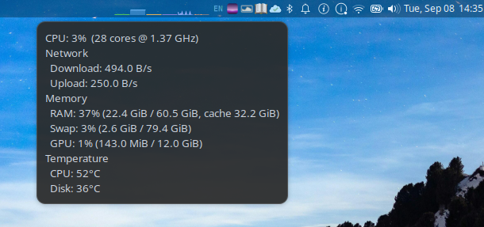

# xfce4-system-monitor-plugin

An Xfce panel plugin showing CPU, memory, swap, GPU memory and network usage as small history graphs, drawn on a transparent background so the panel shows through.

## Screenshots

<br>

<p align="center">
  
  <br>
  System monitor graphs in the panel
</p>

<br>

<p align="center">
  
  <br>
  Hover for details
</p>

## Features

- Display graphs on usage of CPU, memory, swap, GPU memory, and download and upload rates.
- Optional desktop notifications at 75, 80, 85, 90 and 95% memory usage.
- Tooltip shows CPU frequency, memory breakdown, and CPU, disk and GPU temperatures.

## Install

Needs the dev packages for `libxfce4panel-2.0`, `libxfce4util-1.0`, `gtk+-3.0` and `libnotify`, plus `gcc`, `make` and `pkg-config`:

```bash
# Debian / Ubuntu
sudo apt install libxfce4panel-2.0-dev libxfce4util-dev libgtk-3-dev \
                 libnotify-dev build-essential pkg-config

# Fedora
sudo dnf install xfce4-panel-devel libxfce4util-devel gtk3-devel \
                 libnotify-devel gcc make pkgconf-pkg-config
```

Then build and install, as your normal user; the privileged steps self-elevate with `sudo`:

```bash
make install          # Debian / Ubuntu: builds a .deb tracked by dpkg
make && make install-local   # other distros: copies files into PREFIX
```

Add **System Monitor** from the panel's *Add New Items* dialog, restarting the panel with `xfce4-panel -r` if it does not appear. Remove with `make uninstall` or `make uninstall-local`, matching how you installed.

## Configuration

Right-click the plugin and choose *Properties* to set the update interval, the click command, which graphs are shown and their colours, the frame around each graph, and the memory notification. Settings are stored per instance in `~/.config/xfce4/panel/system-monitor-<id>.rc`.

## License

GPL-2.0-or-later, see [LICENSE](LICENSE). This is an independent implementation: it contains no code copied from another panel plugin.
